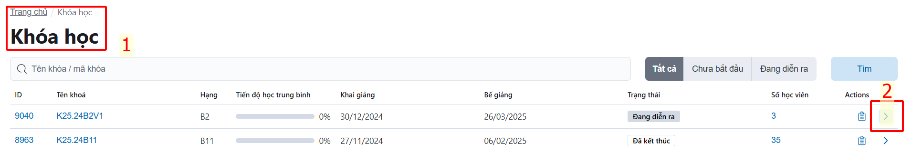
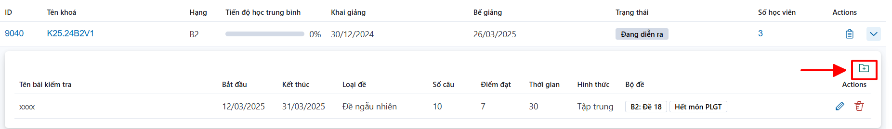
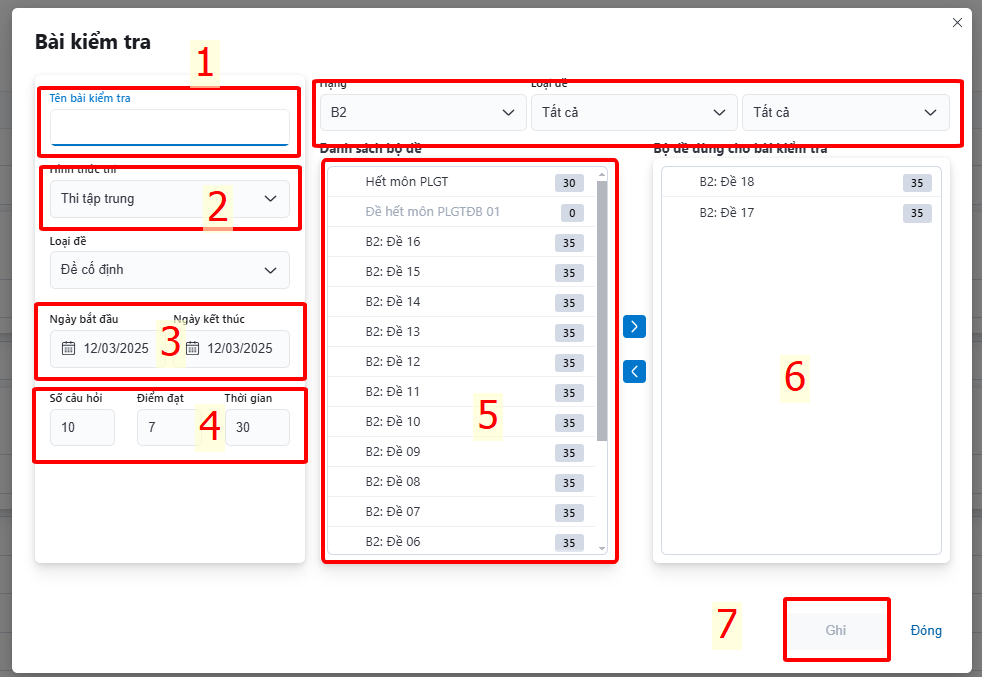
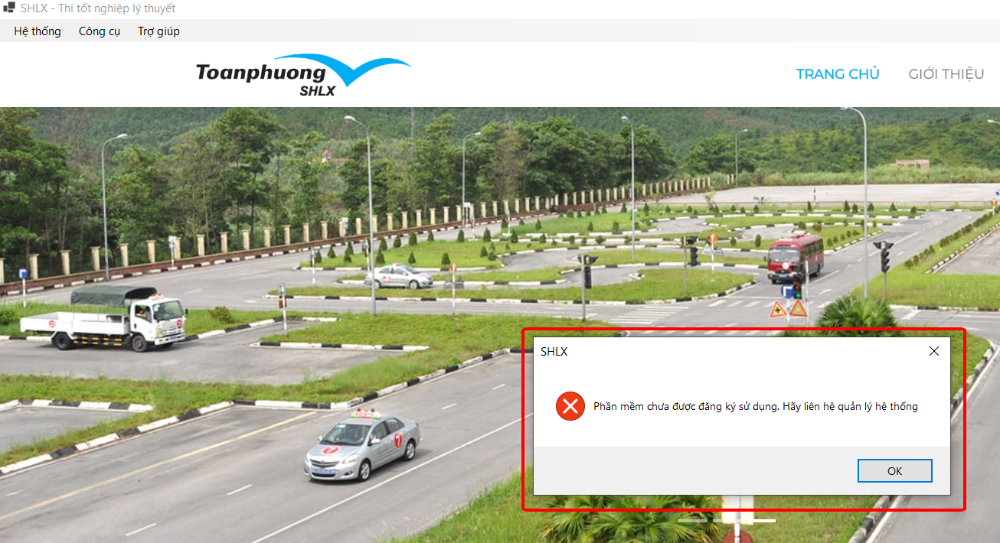
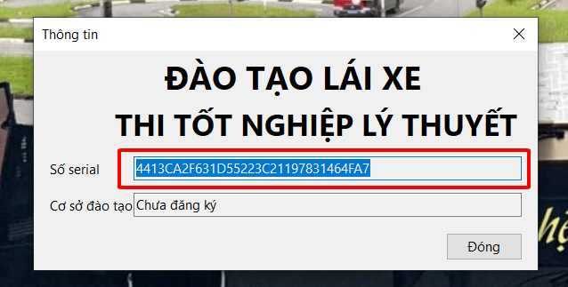
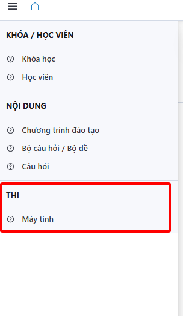
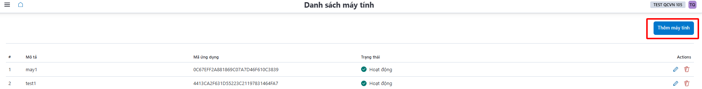
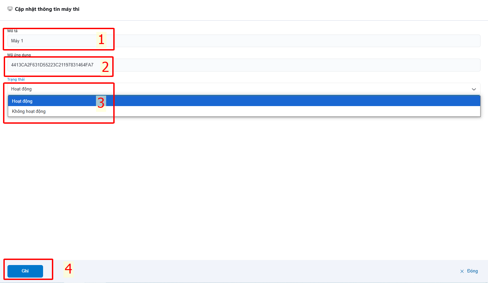
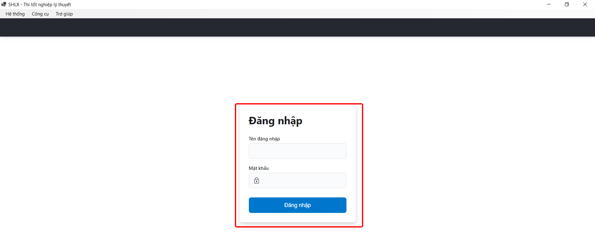

# Chức năng kiểm tra khi kết thúc môn học - (THI TẬP TRUNG)

Theo yêu cầu của cơ quan quản lý nhà nước, kiểm tra các môn học lý thuyết theo hình thức tập trung tại cơ sở đào tạo lái xe **_(thông tư 35/2024/TT-BGTVT ngày 15/11/2024 - Điều 7, Điều 8 mục 4)_**. Hệ thống LMS cung cấp chức năng kiểm tra kết thúc môn tại cơ sở với hình thức tập trung.

Tại **Trang chủ ➔ Khóa học ➔ Chọn một khóa học**:

- Bấm vào mục số 2 ta có:

- Để thêm đề thi vào khóa học ta bấm nút (được chỉ bởi mũi tên) như hình:
  - Danh sách bộ đề thi được xây dựng sẵn hiện ra:

1. Đặt tên cho bài kiểm tra
2. Chọn hình thức thi:
   - **Thi tập trung** (Học viên cần đến thi tại cơ sở đào tạo và đề thi này chỉ hiển thị khi học viên đăng nhập qua ứng dụng **SHLX Exams** được cài đặt tại máy tính của cơ sở)
   - **Thi tự do** ( Cơ sở đào tạo có thể cho học viên kiểm tra thử trước tuyến tại bất cứ đâu - Tuy nhiên kết quả này không được sử dụng để xét tốt nghiệp)
3. Chọn ngày bắt đầu và kết thúc của môn thi - **Quá thời gian cho phép Học viên không thể thực hiện bài thi.**
4. Cơ sở đào tạo tự quy định tiêu chí cho môn thi (số câu hỏi cần phải trả lời, số điểm cần đạt, thời gian làm bài)
5. Chọn đề thi từ thư viện bộ đề đã tạo sẵn
6. Bấm **>** để chuyển qua bên phải
7. Bấm **Ghi** để lưu lại thông số

- Bài kiểm tra đã được tạo, lúc này học viên trong khoá học đã được gán sẽ có thể tiến hành làm bài thi tuỳ theo hình thức TẬP TRUNG hay TỰ DO.

## **Thi tập trung**

- ➤ Cài đặt ứng dụng do công ty Toàn Phương cung cấp tại địa chỉ sau vào máy tính tại cơ sở đào tạo và tiến hành đăng ký số Serial lên máy chủ LMS.
- ➤ [File cài đặt](https://s3-north1.viettelidc.com.vn/apps/shlx-setup.msi)
- ➤ Cài đặt bổ sung các phần mềm sau nếu hệ thống có yêu cầu

  - [NDP48-web](https://go.microsoft.com/fwlink/?LinkId=2085155).
  - [Vc-redistx86](https://aka.ms/vs/17/release/vc_redist.x86.exe).

- Giao diện ứng dụng:
  
- Bấm vào menu **Trợ giúp ➔ Thông tin** ta có bảng sau:
  
- Copy chuỗi **Số serial** để đăng ký vào hệ thống. Việc đăng ký chỉ cần thực hiện lần đầu tiên khi khởi tạo ứng dụng trên máy tính.

1.  Vào chức năng **Thi ➔ Máy tính**
    
2.  Chọn mục **Thêm mới**
    
3.  Hiện ra bảng sau, nhập các thông tin cần thiết
    - Tên máy (Đặt theo nhu cầu)
    - Số serial lấy ở phần mềm SHLX Exame
    - Trạng thái: Hoạt động/ Không hoạt động
    - <a class="button button--secondary">Ghi</a>
      
4.  Cập nhật thành công hệ thống ghi nhận thiết bị
    Sau khi đăng ký thành công, thoát ứng dụng và chạy lại ta sẽ giao diện sau. Học viên tiến hành đăng nhập như bình thường và truy cập vào mục **Bài kiểm tra** để tiến hành thực hiện kiểm tra. Dữ liệu thi này là hợp lệ để xét tốt nghiệp.
    
