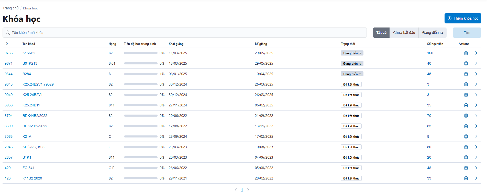
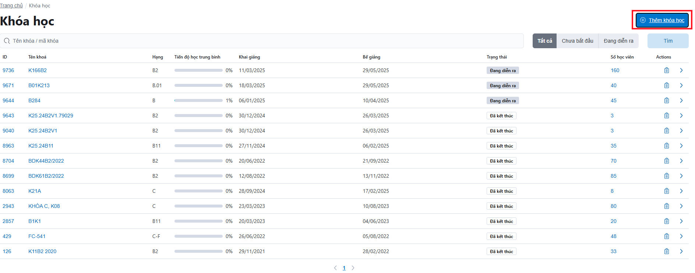
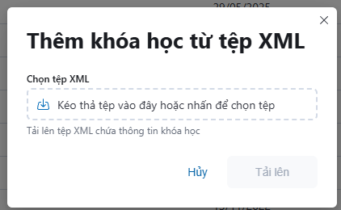
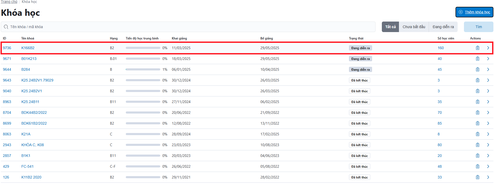
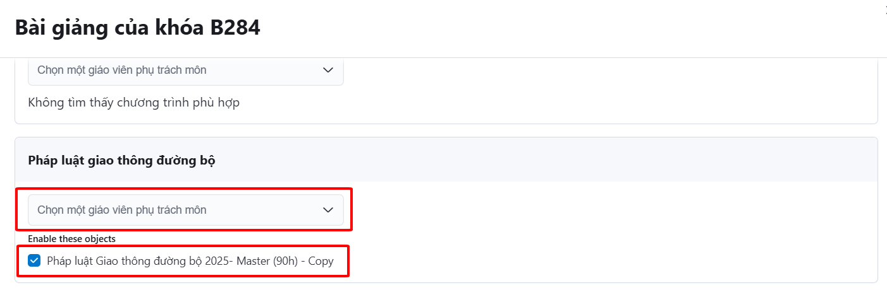
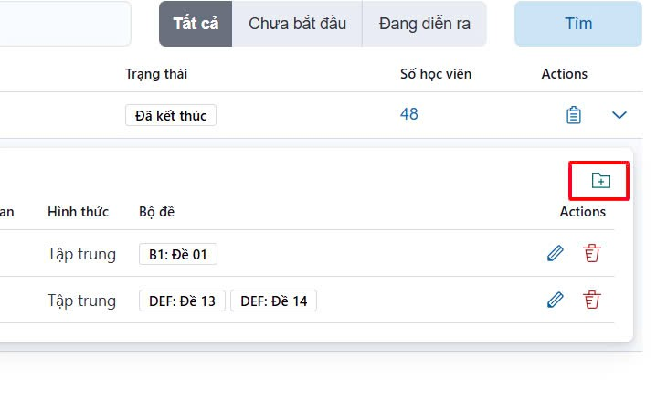
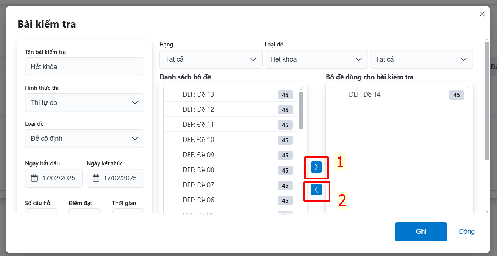

# Khóa học

Người sử dụng có thể quản lý danh sách khóa học của CSĐT, thực hiện các chức năng tìm kiếm, xuất báo cáo lý thuyết của khóa học, tạo thêm/ xóa/ chỉnh sửa bộ đề kiểm tra cho từng khóa học.

- ✅ **1**: Chức năng tìm kiếm khóa.
- ✅ **2**: Chức năng xuất báo cáo tổng hợp kết quả học lý thuyết của khóa.
- ✅ **3**: Chức năng quản lý bộ đề kiểm tra của khóa.

## Nhập khóa học mới

Từ **Trang chủ** 🡆 **Chọn khóa học** 🡆 <a class="button button--primary"> ⊕ Thêm khóa học </a>

Màn hình sau sẽ hiện ra:

- Bấm vào mục Chọn tệp XML 🡆 Chọn File BC1
- Bấm <a class="button button--secondary"> Tải lên </a>
- Tải lên thành công, danh sách khoá học hiển thị lên hệ thống

**Lưu ý**

- **File BC1 phải có mã cơ sở đào tạo trùng với mã cơ sở đào tạo được cung cấp Tài khoản.**
- **Mã cơ sở đào tạo được cung cấp bởi Sở GTVT dùng cho hệ thống DAT, Giáo viên, v.v ...**

## Chức năng tìm kiếm

Người sử dụng có thể quản lý danh sách khóa học của CSĐT, bằng cách tìm kiếm khóa học theo **Tên khóa/ mã khóa**. Lọc trạng thái của khóa **Chưa bắt đầu/ Đang diễn ra/ Tất cả**.

## Chức năng xuất báo cáo khóa học

Cho phép người sử dụng có thể xuất báo cáo, theo dõi/ báo cáo tiến độ học lý thuyết của học viên.

## Thêm chương trình đào tạo vào khoá học cụ thể

- Chọn **Khóa học**
- Bấm <a class="button button--secondary"> Thêm chương trình đào tạo </a>
- Chọn môn học và giáo viên phụ trách. Tích vào ô bên cạnh môn học:

- Bấm **GHI**

## Chức năng quản lý bộ đề kiểm tra của khóa

Cho phép người sử dụng có thể tạo thêm/xóa/chỉnh sửa bộ đề kiểm tra của khóa học.
- Cách tạo thêm đề kiểm tra cho khóa học: chọn nào biểu tượng như trong hình.

- Điền thông tin **Tên bài kiểm tra**, **Hạng**, **Ngày bắt đầu – Ngày kết thúc**,… Nhấn vào bộ đề cần chọn 🡪 dùng biểu tượng **dấu lớn ⯈** để chọn bộ đề, hoặc dùng **dấu bé ⯇** để bỏ chọn bộ đề 🡪 Sau đó bấm chọn <a class="button button--secondary"> Ghi </a> để hoàn thành tác vụ.

## Chức năng quản lý bộ đề kiểm tra của khóa

