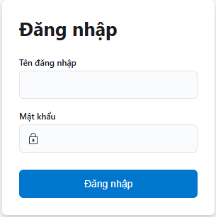
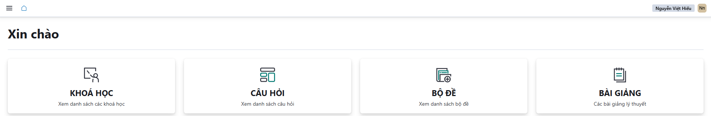

# ĐĂNG NHẬP VÀO HỆ THỐNG

Mỗi CSĐT sẽ được đơn vị quản lý cung cấp cho một **địa chỉ trang web** và **tài khoản** để đăng nhập vào hệ thống.

## Đăng nhập

Đăng nhập vào trang **[admin.lms.shlx.vn](https://admin.lms.shlx.vn/login)** sẽ hiển thị màn hình **Đăng nhập** như sau :

- Điền đầy đủ **Tên đăng nhập** và **Mật khẩu**; nhấn **Đăng nhập**. Được cung cấp bởi Công Ty Toàn Phương
- Sau khi đăng nhập vào màn hình giao diện trang chủ sẽ như dưới đây:

Xuất hiện giao diện trang chủ của quản lý Học lái xe trực tuyến. Tại đây người dùng có thể thực hiện được các việc sau:

- ✅ **Khóa học**: Quản lý khóa học của CSĐT.
- ✅ **Câu hỏi**: Quản lý danh sách câu hỏi ôn tập/ kết thúc môn.
- ✅ **Bộ đề**: Quản lý danh sách bộ đề ôn tập/ kết thúc môn.
- ✅ **Bài giảng**: Quản lý danh sách bài giảng/ môn học
