# Bài giảng

Người sử dụng có thể quản lý, tạo thêm/ chỉnh sửa/ phân loại hạng cho danh sách bài giảng

## Tìm kiếm

- Từ màn hình người sử dụng, nhập tên khóa/ mã khóa cần tìm, nhấn.
- Danh sách bài giảng thỏa mãn điều kiện tra cứu sẽ được hiển thị.

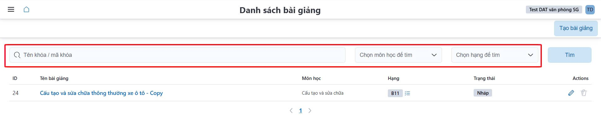

## Chỉnh sửa bài giảng

- **Chỉnh sửa phân loại hạng cho bài giảng**

  - Từ màn hình người sử dụng chọn biểu tượng (1) như trong ảnh
    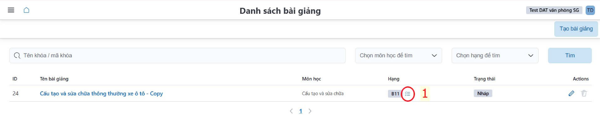
  - Người sử dụng chọn **Hạng (1)** phù hợp, sau đó dùng biểu tượng **dấu lớn/ dấu bé (2)** để thêm hạng hoặc xóa hạng trước đó.
    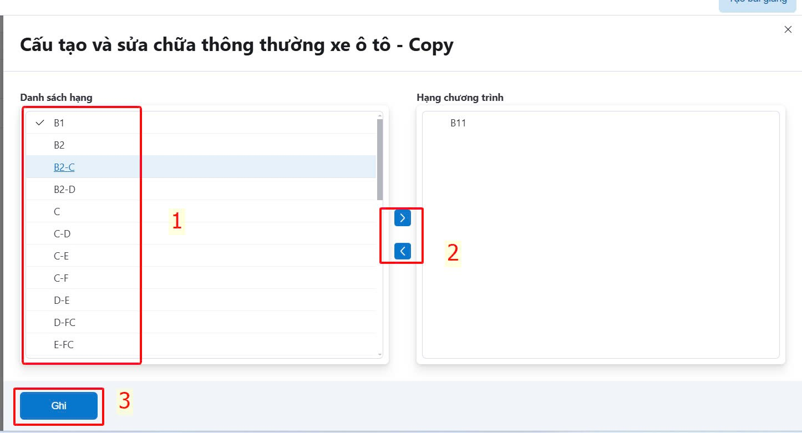
  - Để hoàn thành tác vụ, người sử dụng bấm **Ghi (3)**.

- **Chỉnh sửa thông tin bài giảng**
  - Từ màn hình người sử dụng chọn biểu tượng chỉnh sửa như trong ảnh ✏️
    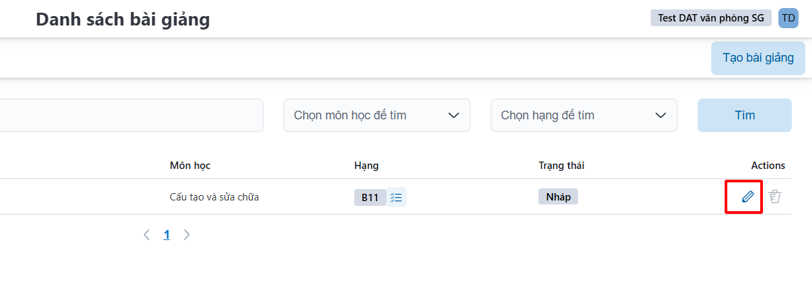
  - Người sử dụng có thể chỉnh sửa **Môn học**, **Tên bài giảng**, **Trạng thái của khóa (Nháp/ Công bố)**.
    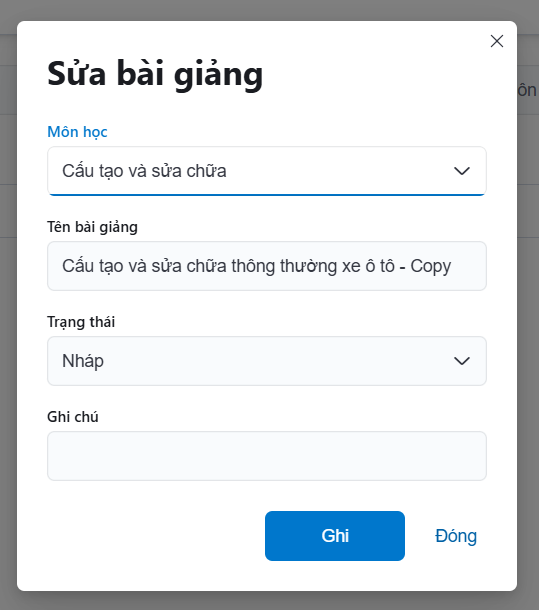

## Thêm mới bài giảng

- Từ màn hình người sử dụng nhấn chọn <a class="button button--primary">Tạo bài giảng</a>
  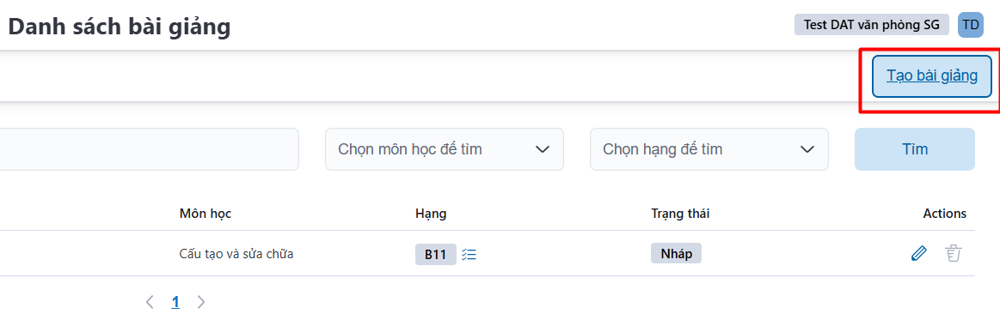
- Người sử dụng điền thông tin **Môn học, Tên bài giảng, Trạng thái bài giảng**.
  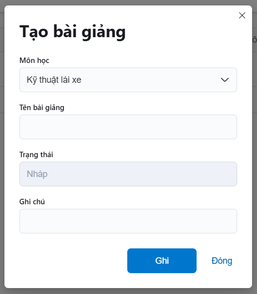

### Soạn nội dung bài giảng

- Tại **Danh sách bài giảng**, để soạn nội dung bài giảng. Người sử dụng bấm chọn vào tên Bài giảng cần soạn nội dung.
  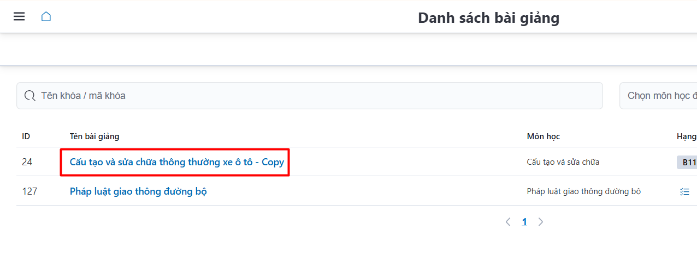
  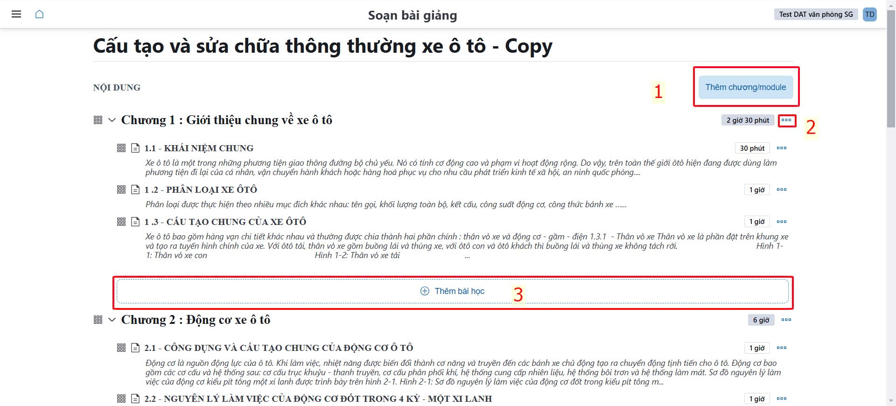

- ✅ **1**: Quản lý khóa học của CSĐT.
- ✅ **2**: Quản lý danh sách câu hỏi ôn tập/ kết thúc môn.
- ✅ **3**: Quản lý danh sách bộ đề ôn tập/ kết thúc môn.

### Chức năng thêm Chương/ Module

- Người sử dụng nhập tên Module/Chương sau đó bấm <a class="button button--secondary">Ghi</a> để hoàn thành tác vụ.
  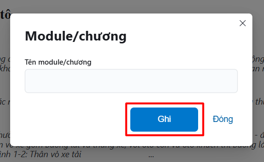

### Chức năng chỉnh sửa/ xóa nội dung bài học

- Người sử dụng có thể sửa **Tên bài học/ Thời gian yêu cầu môn học/ Xóa nội dung bài học**. sau đó bấm <a class="button button--secondary">Ghi</a> để hoàn thành tác vụ.

  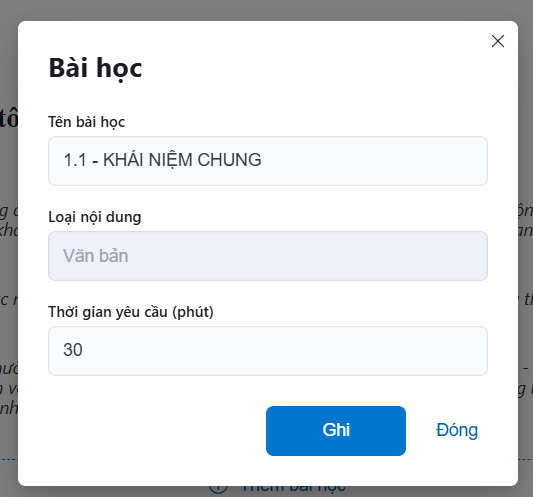

- Để chỉnh sửa nội dung bài học, người sử dụng bấm vào tên bài học.

  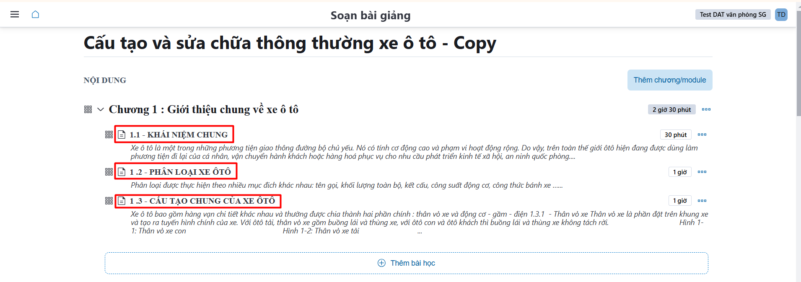

- Người sử dụng soạn nội dung/ thêm file audio **(1)**, sau đó bấm **Ghi (2)** đề hoàn thành tác vụ hoặc **Đóng (3)** để hủy tác vụ.  

  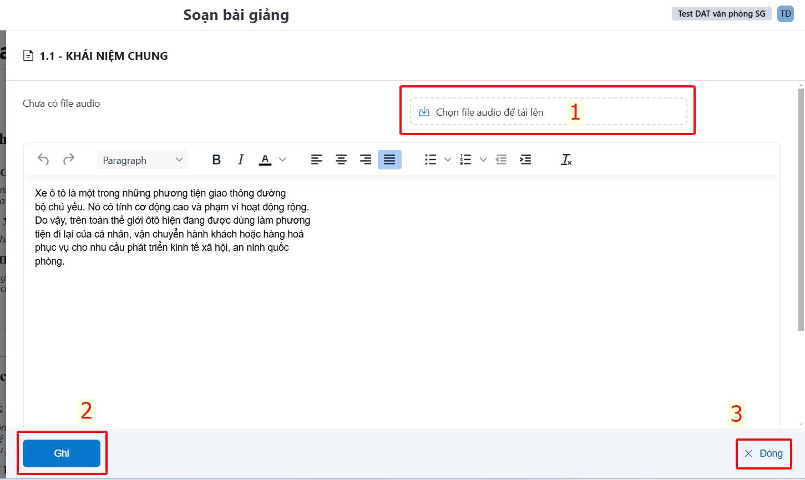