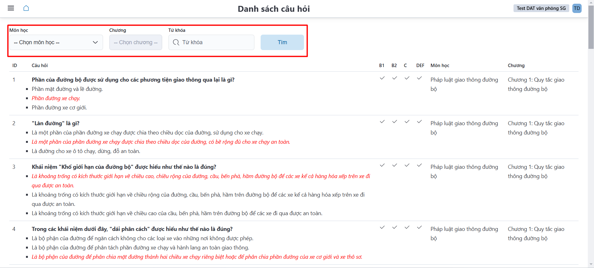
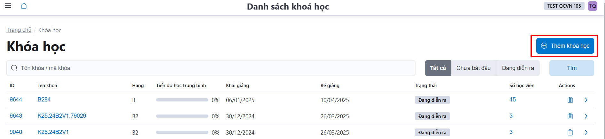
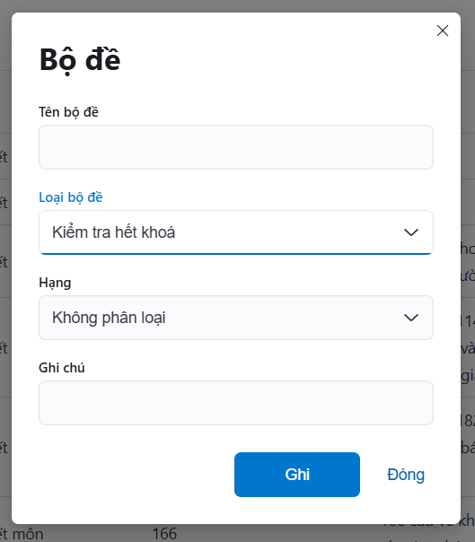

# Bộ đề

Người sử dụng có thể **quản lý, tạo thêm/ chỉnh sửa/ xóa** danh sách bộ đề cho từng hạng, loại kiểm tra,… phục vụ thi tập trung/ thi trực tuyến,

**Ghi chú: Đối với hình thức thi tập trung đề nghị xem Chức năng kiểm tra khi kết thúc môn học - (THI TẬP TRUNG) để biết thêm chi tiết**
- Cách tạo thêm bộ đề: **Bấm chọn** <a class="button button--primary"> Thêm bộ đề </a>

- Sau khi bấm chọn **Bấm chọn** <a class="button button--primary"> Thêm bộ đề </a>, cửa sổ hiện lên và người sử dụng điền **Tên bộ đề**, **Loại bộ đề**,... Sau đó bấm <a class="button button--secondary"> Ghi </a> để hoàn thành tạo bộ đề. 

- Dùng **biểu tượng cây viết** ✏️ để chỉnh sửa bộ đề, hoặc dùng **biểu tượng thùng rác**  🗑️

