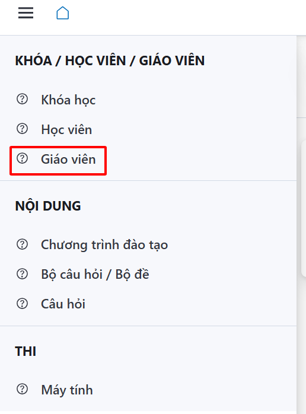
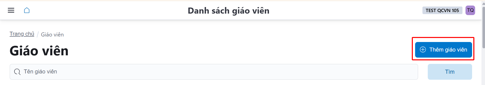
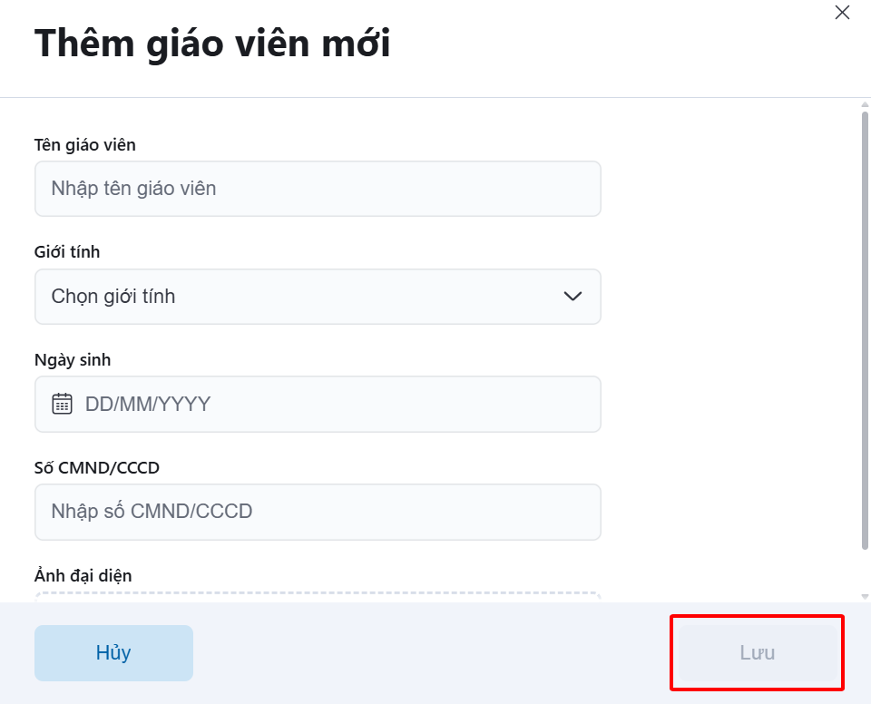
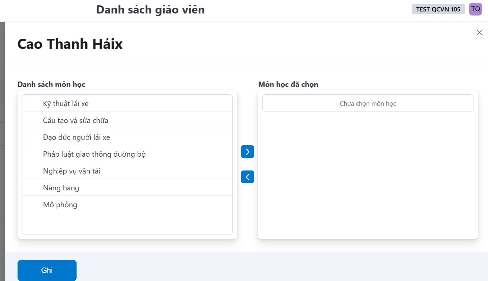

# Chức năng thêm giáo viên cho hệ thống và chọn giáo viên phụ trách môn học

- Chức năng thêm giáo viên cho hệ thống.
- Tại Tab Menu, người sử dụng bấm chọn **Giáo viên**.

  

- Chọn <a class="button button--primary">Thêm giáo viên</a>

  

- Nhập các thông tin của giáo viên, sau đó bấm <a class="button button--secondary">Lưu</a> để hoàn thành tác vụ.

  

- Chức năng thêm giáo viên phụ trách môn học:
    - Chọn vào biểu tượng **☰**
    - Màn hình hiển thị ra cửa sổ, người sử dụng tick chọn môn học giáo viên phụ trách giảng dạy, sau đó bấm <a class="button button--secondary">Lưu</a> để hoàn thành tác vụ.
    
      